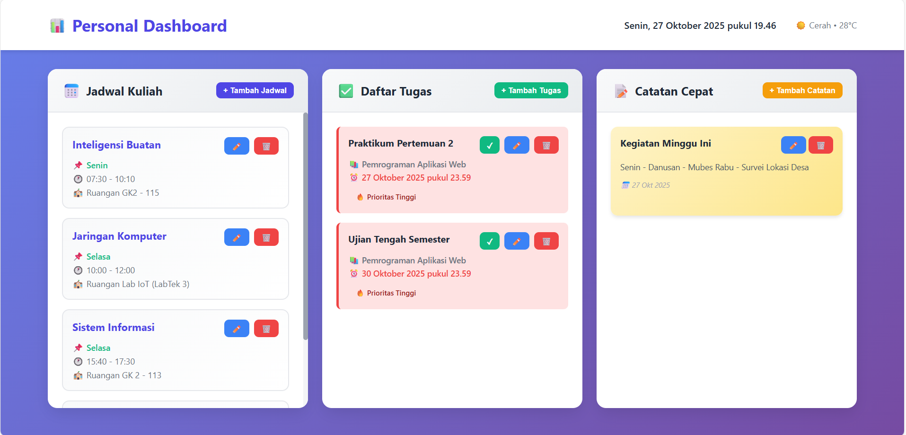
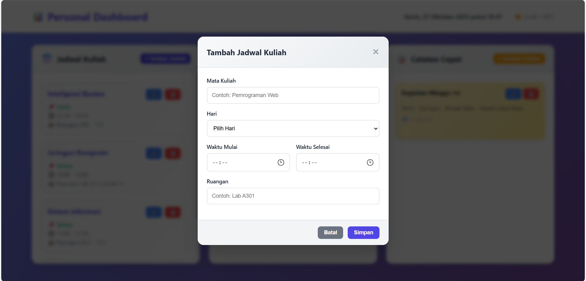
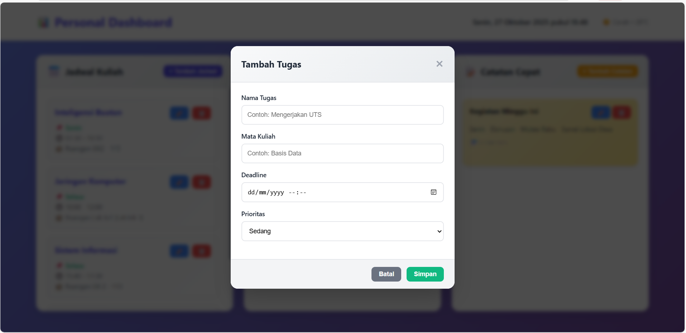
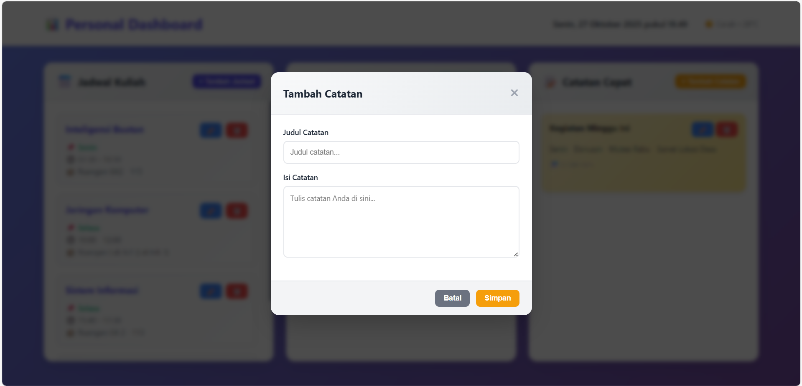

# Personal Dashboard 

## Deskripsi Aplikasi

Personal Dashboard adalah aplikasi web interaktif yang dirancang untuk membantu mahasiswa mengelola aktivitas akademik mereka secara efisien. Aplikasi ini menyediakan berbagai fitur untuk mengatur jadwal kuliah, mengelola tugas, membuat catatan, serta menampilkan informasi waktu dan motivasi harian.

### Tujuan
- Memudahkan mahasiswa dalam mengorganisir jadwal kuliah
- Membantu tracking dan manajemen tugas-tugas akademik
- Menyediakan tempat untuk catatan cepat
- Memberikan motivasi harian melalui quotes inspiratif
- Menampilkan informasi waktu real-time

## Fitur-Fitur Utama

### 1. **Jadwal Kuliah** 
- Tambah, edit, dan hapus jadwal kuliah
- Informasi lengkap: Mata kuliah, hari, waktu, dan ruangan
- Tampilan terorganisir berdasarkan jadwal

### 2. **Daftar Tugas** 
- CRUD (Create, Read, Update, Delete) tugas
- Sistem prioritas (Tinggi, Sedang, Rendah)
- Tandai tugas sebagai selesai/belum selesai
- Deadline dengan format tanggal dan waktu
- Visual indicator berdasarkan prioritas

### 3. **Catatan Cepat** 
- Buat catatan dengan judul dan isi
- Edit dan hapus catatan
- Tampilan sticky notes yang menarik
- Timestamp otomatis untuk setiap catatan

### 4. **Motivasi Hari Ini** 
- Quote motivasi yang di-fetch dari API eksternal
- Fallback quotes lokal jika API tidak tersedia
- Refresh untuk mendapatkan quote baru
- Implementasi Async/Await

### 5. **Informasi Waktu & Cuaca** 
- Jam digital real-time
- Tanggal lengkap dalam bahasa Indonesia
- Informasi cuaca (simulasi)


## 📸 Screenshot Aplikasi

### 1. Tampilan Dashboard Utama

Menampilan Jadwal kuliah, daftar tugas, catatan cepat.

### 2. Form Tambah Jadwal Kuliah

Modal form untuk menambahkan jadwal kuliah baru

### 3. Daftar Tugas dengan Prioritas

Task list dengan color coding berdasarkan prioritas

### 4. Catatan Cepat

Sticky notes style untuk catatan cepat


## Fitur ES6+ yang Diimplementasikan

### 1. **let dan const**
```javascript
// const untuk nilai yang tidak berubah
const dashboard = new Dashboard();

// let untuk nilai yang bisa berubah
let editingId = null;
```

Digunakan di seluruh file `script.js`
- Semua variabel menggunakan `let` atau `const`
- Tidak ada penggunaan `var`

---

### 2. **Arrow Functions** (>3 implementasi)

**Contoh 1: Method dalam Class**
```javascript
openModal = (id = null) => {
    this.editingId = id;
}
```

**Contoh 2: Array Map**
```javascript
container.innerHTML = tasks.map(task => `
    <div class="task-item">...</div>
`).join('');
```

**Contoh 3: Format Date**
```javascript
formatDeadline = (deadline) => {
    const date = new Date(deadline);
    return date.toLocaleDateString('id-ID', {...});
}
```

**Contoh 4: Update Clock**
```javascript
updateClock = () => {
    const now = new Date();
    // ... update display
}
```
---

### 3. **Template Literals**

**Contoh: Rendering Dynamic HTML**
```javascript
container.innerHTML = `
    <div class="schedule-item">
        <h3>${schedule.course}</h3>
        <div>🕐 ${schedule.startTime} - ${schedule.endTime}</div>
        <div>🏫 Ruangan ${schedule.room}</div>
    </div>
`;
```
---

### 4. **Async/Await**

**Implementasi di QuoteManager Class:**
```javascript
async fetchNewQuote() {
    const container = document.getElementById('quoteDisplay');
    container.innerHTML = '<p class="quote-loading">Memuat quote baru...</p>';

    try {
        const response = await fetch(this.quoteAPI);
        
        if (!response.ok) {
            throw new Error('Gagal memuat quote dari API');
        }

        const data = await response.json();
        this.displayQuote(data.content, data.author);
    } catch (error) {
        console.error('Error fetching quote:', error);
        this.displayFallbackQuote();
    }
}

async init() {
    await this.fetchNewQuote();
}
```
- Menggunakan `async/await` untuk fetching data dari API
- Error handling dengan try-catch
- Fallback mechanism jika API gagal

---

### 5. **Classes** (Multiple Classes)

**Base Class:**
```javascript
class DataManager {
    constructor(storageKey) {
        this.storageKey = storageKey;
        this.data = this.loadFromStorage();
    }
    // ... methods
}
```
---

### 6.**Destructuring**

**Object Destructuring:**
```javascript
container.innerHTML = tasks.map(({ id, name, course, deadline, priority, completed }) => `
    <div class="task-item">
        <h3>${name}</h3>
        <div>${course}</div>
    </div>
`).join('');
```

---

### 7. **Spread Operator**

**Contoh 1: Menambah item ke array**
```javascript
add(item) {
    this.data.push({ ...item, id: Date.now() });
    this.saveToStorage();
}
```

**Contoh 2: Update item**
```javascript
update(id, updatedItem) {
    const index = this.data.findIndex(item => item.id === id);
    if (index !== -1) {
        this.data[index] = { ...this.data[index], ...updatedItem };
        this.saveToStorage();
    }
}
```

**Contoh 3: Copy array**
```javascript
getAll() {
    return [...this.data];
}
```
---

### 8.**Additional ES6+ Features**

**Array Methods (map, filter, find, findIndex):**
```javascript
// Map
tasks.map(task => `<div>...</div>`).join('');

// Filter
this.data = this.data.filter(item => item.id !== id);

// Find
const task = this.data.find(item => item.id === id);

// FindIndex
const index = this.data.findIndex(item => item.id === id);
```

**Default Parameters:**
```javascript
openModal = (id = null) => {
    // id has default value of null
}
```

**Enhanced Object Literals:**
```javascript
const scheduleData = { course, day, startTime, endTime, room };
// Shorthand for: { course: course, day: day, ... }
```

---
